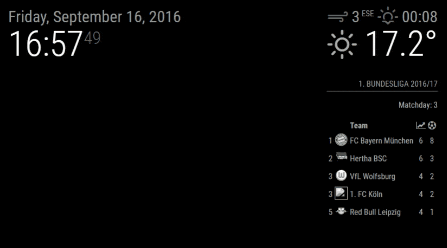

# MMM-ModuleScheduler
A [MagicMirror²](https://magicmirror.builders) helper module to schedule when modules should be shown, hidden or dimmed and when notifications should be sent.

[](https://raw.githubusercontent.com/ianperrin/MMM-ModuleScheduler/master/LICENSE)
[](https://travis-ci.org/ianperrin/MMM-ModuleScheduler)
[](https://snyk.io/test/github/ianperrin/MMM-ModuleScheduler)



## Installation

In your terminal, go to your MagicMirror's Module folder:
````
cd ~/MagicMirror/modules
````

Clone this repository:
````
git clone https://github.com/ianperrin/MMM-ModuleScheduler.git
````

Go to the modules folder:
````
cd MMM-ModuleScheduler
````

Install the dependencies:
````
npm install --production
````

Add the module to the modules array in the `config/config.js` file:
````javascript
    {
        module: 'MMM-ModuleScheduler'
    },
````

## Config Options
| **Option** | **Default** | **Description** |
| --- | --- | --- |
| `schedulerClass` | 'scheduler' | **Optional** The name of the class which should be used to identify the modules which have an individual schedule. |
| `animationSpeed` | 1000 | **Optional** The speed of the show and hide animations in milliseconds |
| `notification_schedule` |  | **Optional** A single, or array of multiple definitions to schedule when notifications should be sent. See [Scheduling Notifications](#scheduling-notifications)  |
| `global_schedule` |  | **Optional** A single, or array of multiple definitions to schedule when all modules should be shown/hidden/dimmed. See [Global Schedules](#global-schedules)  |
| `debug` | `true` | **Optional** Outputs messages to the console/log when set to `true` |

## Config Examples

### Scheduling Notifications
To schedule the sending of a notification to other modules, add a `notification_schedule` definition to the MMM-ModuleScheduler config, e.g.
````javascript
    {
        module: 'MMM-ModuleScheduler',
        config: {
            // SHOW AN ALERT AT 09:30 EVERY DAY (see https://github.com/MichMich/MagicMirror/tree/develop/modules/default/alert)
            notification_schedule: {
                notification: 'SHOW_ALERT', 
                schedule: '30 9 * * *', 
                payload: {
                    type: "notification", 
                    title: 'Scheduled alert!'
                }
            }
        }
    },
````
**Notes** 
* `notification` is required and should be the identifier of the notification to be sent to all other modules. 
* `schedule` is required and determines when the notification will be sent. It should be a valid cron expression - see [crontab.guru](http://crontab.guru/). 
* `payload` is optional and its contents will be determined by the module receiving the notification. 

#### Scheduling Multiple Notifications
Multiple `notification_schedule` definitions can be added using an array, e.g.

````javascript
    {
        module: 'MMM-ModuleScheduler',
        config: {
            notification_schedule: [
                // SHOW AN ALERT AT 07:30 EVERY DAY
                {notification: 'SHOW_ALERT', schedule: '30 7 * * *', payload: {type: "notification", title: 'Good morning!'}},
                // SHOW AN ALERT AT 17:45 EVERY DAY
                {notification: 'SHOW_ALERT', schedule: '17 45 * * *', payload: {type: "notification", title: 'Good afternoon!'}}
            ]
        }
    },
````

#### Scheduling actions to control your MagicMirror, Pi and monitor/screen
Used in conjunction with [MMM-Remote-Control](https://github.com/Jopyth/MMM-Remote-Control) module, the `notification_schedule` definitions can create schedules to control your MagicMirror, Pi and monitor/screen, e.g.

````javascript
    {
        module: 'MMM-ModuleScheduler',
        config: {
            notification_schedule: [
                // TURN THE MONITOR/SCREEN ON AT 07:30 EVERY DAY
                {notification: 'REMOTE_ACTION', schedule: '30 7 * * *', payload: {action: "MONITORON"}},
                // TURN THE MONITOR/SCREEN OFF AT 22:30 EVERY DAY
                {notification: 'REMOTE_ACTION', schedule: '30 22 * * *', payload: {action: "MONITOROFF"}},
                // RESTART THE MAGICMIRROR PROCESS AT 2am EVERY SUNDAY
                {notification: 'REMOTE_ACTION', schedule: '0 2 * * SUN', payload: {action: "RESTART"}}
            ]
        }
    },
````
**Notes** 
* A full list of remote actions available for controlling your MagicMirror, Pi and monitor/screen are available in the [MMM-Remote-Control module documentation](https://github.com/Jopyth/MMM-Remote-Control#list-of-actions)
* If you simply want to hide and show modules, it is recommended to use the module display scheduling options defined below, rather than the `SHOW` and `HIDE` remote actions. 

### Scheduling Module Display

#### Global Schedules
To schedule when all modules are shown (or hidden) by the Magic Mirror, add a `global_schedule` definition to the MMM-ModuleScheduler config, e.g.
````javascript
    {
        module: 'MMM-ModuleScheduler',
        config: {
            // SHOW ALL MODULES AT 06:00 AND HIDE AT 22:00 EVERY DAY
            global_schedule: {from: '0 6 * * *', to: '0 22 * * *' },
        }
    },
````
#### Group Schedules
To apply a schedule to a group of modules, add the `groupClass` option to the `global_schedule` definition, e.g.
````javascript
    {
        module: 'MMM-ModuleScheduler',
        config: {
            // SHOW MODULES WITH THE CLASS 'daytime_scheduler' AT 06:00 AND HIDE AT 22:00 EVERY DAY
            global_schedule: {from: '0 6 * * *', to: '0 22 * * *', groupClass: 'daytime_scheduler'},
        }
    },
    {
        module: 'clock',
        position: 'top_left',
        classes: 'daytime_scheduler'
    }
    {
        module: 'compliments',
        position: 'lower_third',
        classes: 'daytime_scheduler'
    },

````
**Notes** 
* Modules scheduled as a group, only need the `groupClass` adding to the `classes` option in their config. The `schedulerClass` option can be omitted unless indiviudal schedules also exist.

#### Individual Module Schedules
To schedule when an individual module is shown (or hidden) by the Magic Mirror, modify the configuration for that module so that it includes the `classes` and `module_schedule` options. e.g. 
````javascript
    {
        module: 'calendar',
        header: 'US Holidays',
        position: 'top_left',
        classes: 'scheduler',
        config: {
            // DISPLAY THE CALENDAR BETWEEN 09:00 and 18:00 ON WEDNESDAYS
            module_schedule: {from: '0 9 * * 3', to: '0 18 * * 3' },
            calendars: [
                {
                    symbol: 'calendar-check-o ',
                    url: 'webcal://www.calendarlabs.com/templates/ical/US-Holidays.ics'
                }
            ]
        }
    },
````
**Notes** 
* `from` is required and determines when the module will be shown. It should be a valid cron expression - see [crontab.guru](http://crontab.guru/). 
* `to` is required and determines when the module will be hidden. It should be a valid cron expression - see [crontab.guru](http://crontab.guru/). 

#### Dimming Modules
To dim modules, rather than hide them, add the `dimLevel` option (as a percentage between 0 and 100) to the `global_schedule` and `module_schedule` definitions. e.g.
````javascript
    {
        module: 'MMM-ModuleScheduler',
        config: {
            // SHOW ALL MODULES AT 06:00 AND DIM THEM TO 40% AT 22:00
            global_schedule: {from: '0 6 * * *', to: '0 22 * * *', dimLevel: '40' },
        }
    },
    {
        module: 'clock',
        position: 'top_left',
        classes: 'scheduler',
        config: {
            // SHOW THE CLOCK AT 06:30 AND DIM IT TO 25% AT 22:30 
            module_schedule: {from: '30 6 * * *', to: '30 22 * * *', dimLevel: '25'}
        }
    },
````
**Note:** 
* The modules will be shown (full brightness) based on the `from` expression
* The modules will then either be dimmed (if the `dimLevel` option is set) based on the `to` expression. 
* Take care when adding both `global_schedule` and `module_schedule` definitions as MMM-ModuleScheduler performs no validation that they will be compatible.

#### Multiple Schedules
For more complex scheduling, multiple `global_schedule` and `module_schedule` definitions can be added using an array, e.g. 
````javascript
    {
        module: 'MMM-ModuleScheduler',
        config: {
            global_schedule: [
                // SHOW MODULES WITH THE CLASS 'morning_scheduler' AT 06:00 AND HIDE AT 09:00 EVERY DAY
                {from: '0 6 * * *', to: '0 9 * * *', groupClass: 'morning_scheduler'},
                // SHOW MODULES WITH THE CLASS 'evening_scheduler' AT 17:00 AND HIDE AT 23:00 EVERY DAY
                {from: '0 17 * * *', to: '0 22 * * *', groupClass: 'evening_scheduler'},
            ]
        }
    },
    {
        module: 'clock',
        position: 'top_left',
        classes: 'scheduler',
        config: {
            // DISPLAY BETWEEN 09:30 ON SATURDAYS AND 22:30 ON SUNDAYS, 
            // THEN AGAIN BETWEEN 20:00 AND 23:00 ON TUESDAYS AND WEDNESDAYS 
            module_schedule: [
                {from: '30 9 * * SAT', to: '30 22 * * SUN'}, 
                {from: '0 20 * * 2-3', to: '0 23 * * 2-3'}
            ]
        }
    },
````
**Note:** 
* Take care when adding both `global_schedule` and `module_schedule` definitions as MMM-ModuleScheduler performs no validation that they will be compatible.

#### Ignoring Modules
To ignore modules from being shown, hidden or dimmed by a global schedules, add the `ignoreModules` option to the `global_schedule` definition e.g. 
````javascript
    {
        module: 'MMM-ModuleScheduler',
        config: {
            // SHOW ALL MODULES EXCEPT clock AND calender BETWEEN 06:00 AND 22:00
            global_schedule: {from: '0 6 * * *', to: '0 22 * * *', ignoreModules: ['clock', 'calendar'] },
        }
    },
````
**Note:** 
* Modules are ignored based on their name, as defined in the config file. If multiple instances of a single module are defined in the `config.js` file, all instances will be ignored using this option.

## Updating

To update the module to the latest version, use your terminal to go to your MMM-ModuleScheduler module folder and type the following command:

````
git pull
```` 

If you haven't changed the modules, this should work without any problems. 
Type `git status` to see your changes, if there are any, you can reset them with `git reset --hard`. After that, git pull should be possible.
